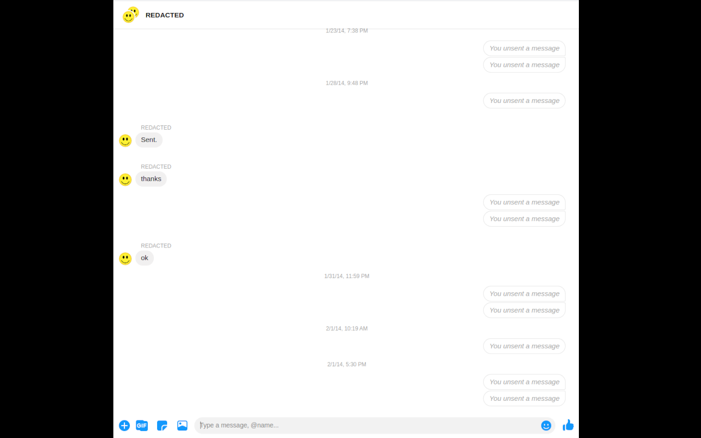

### Help! The extension is broken!

Don't panic. Facebook changes the messenger UI every now and then, which inevitably breaks this tool. File a bug in the issues panel above. I generally am pretty swamped with other projects, so this tool may be broken for weeks at a time. If you need a really quick turn around, please sponsor some of my time [here](https://www.buymeacoffee.com/theahura/e/136718).

# What is Shoot the Messenger?

Shoot the Messenger is a Chrome extension that automatically unsends every message you have in a messenger chain. Unlike other extensions, which only hide the messages from the user's inbox, Shoot the Messenger will remove messages from the RECEIVER'S inbox as well. 

Open a messenger thread, hit 'Remove Messages', and go get a coffee. While you're gone, the extension will click on every 'unsend message' button, leaving behind a trail of nothing.

  
  
After using Shoot the Messenger, you WILL NOT be able to access your messages (unless FB releases them for some reason). I HIGHLY recommend backing up your messenger data before using this extension.

There are a few other settings for things like:
- choosing which message to start deleting from
- setting a 'delay' time to avoid rate limits

# Installing

## Google Chrome

Download on the chrome webstore [here](https://chrome.google.com/webstore/detail/shoot-the-messenger/lkhmjelfhkidbekjkghmbacoaolbcmep?hl=en). 

### Downloading nightly.

If you want the latest version, you can git clone the repo and install it as an unpacked extension. You can see how here: https://developer.chrome.com/docs/extensions/mv2/getstarted/

1) Clone or download the code in this repo somewhere on your computer. 
2) Go to chrome://extensions and hit developer mode on the top right.
3) Hit load unpacked, and then select the directory where you downloaded the code from this repo. 
4) If you did everything right, the shoot the messenger logo should appear in your extension list.
5) Go to messenger.com and click on a thread you want to delete. Click the extension, hit remove, and hopefully things happen.

## Firefox

**NOTE**: This extension is mainly developed with Google Chrome in mind. Which means that any updates to source *might* break in Firefox. So import this extension to Firefox at your discretion.

### Downloading nightly

**NOTE:** This will load the extension **temporarily**, meaning, that the extension will be removed when Firefox is closed and you will have to load it again.

1) Clone or download the code in this repository somewhere on your computer
2) Follow the instructions [here](https://extensionworkshop.com/documentation/publish/package-your-extension/) to package the extension into a `.zip` file.
3) Open Firefox and go to `about:debugging#/runtime/this-firefox` (using the address/URL bar) page.
4) Click the `Load Temporary Add-on...` button.
5) Select the `.zip` packaged extension created in step 2.

# How to Use
1) Go to messenger.com
2) Open the messenger chain that you want to delete
3) Click the extension and hit remove messages
4) Leave the tab running. If you want to keep using the web on your computer, open a new browser.
5) If you start getting hit with rate limiting by Facebook (generally an error, 'Cannot unsend at this time'), increase the `Rate limit pause` time in the Extension popup. The default is 5 seconds.

### Misc notes.

- If you're looking for something similar on Insta, checkout https://github.com/pishangujeniya/instagram-helper.
- While for the most part unsending messages does not result in notifications for the other party, some iPhone users reported getting a lot of notifications as messages were being removed. The content of the message was not present. Specifically, I've had friends with Messenger v291.2+ on iPhone getting notifications when messages are removed. Unfortunately, because of the nature of Shoot the Messenger, this can result in a lot of inadvertent spam sent to Facebook friends. See this issue for more: https://github.com/theahura/shoot-the-messenger/issues/58#issuecomment-1064502975
- not all messages can be unsent. For example, I've been unable to remove some messages with links in them, and stickers give a lot of trouble. This isn't a problem with the extension, so much as a problem with Facebooks removal backend. This seems to happen more with older messages.
- facebook constantly runs A/B tests, some of which may break this extension. File an issue if something weird happens -- or more likely, doesn't happen.
